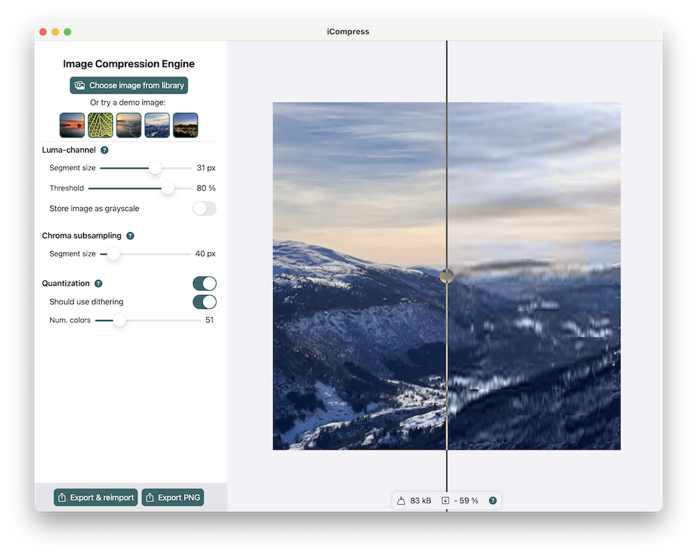

# iCompress

An exploration into methods of lossy image compression.  
My winning Apple WWDC 22 Swift Student Challenge submission.

## About

For this year’s submission, I leveraged my interest for the applications of Fourier Analysis in signal processing, to create an app exploring various techniques of lossy image compression. After writing about the mathematics of pitch correction (Auto-Tune) in Mathematics, I started working on an app to compress grayscale images using the Discrete Cosine Transform (DCT). That app turned into an investigation into various techniques used in image compression.

The app uses mainly three algorithms to reduce image size in a lossy way:  

- Discrete Cosine Transform in 2D for the grayscale-channel—looking at each row and column of the image as a signal, and extracting the intensity of each frequency in the image so that the higher frequencies can be removed, leaving out fine detail.  

- Chroma Subsampling for the color-channel—which reduces the resolution of the two color-channels, Cr and Cb.  

- Color-Quantization which limits the number of colors to less than 256 such that the colors can be stored in a look-up-table. This effectively halves the number of bytes used for the color channel.

I focused a lot on optimization and speed of the app. I therefore wrote most of the image algorithms as shaders to be run with Metal, and made use of direct memory access with UnsafePointer. This left me with some quite unenjoyable memory leaks, which I hope to have resolved😅.  

## Instructions

- Download this repo
- Open `ImageCompressionEngine.swiftpm` in either Xcode on a Mac or Swift Playgrounds 4 on an iPad.
- Build and run.  

**Note:** The app has only been tested on iOS 15
